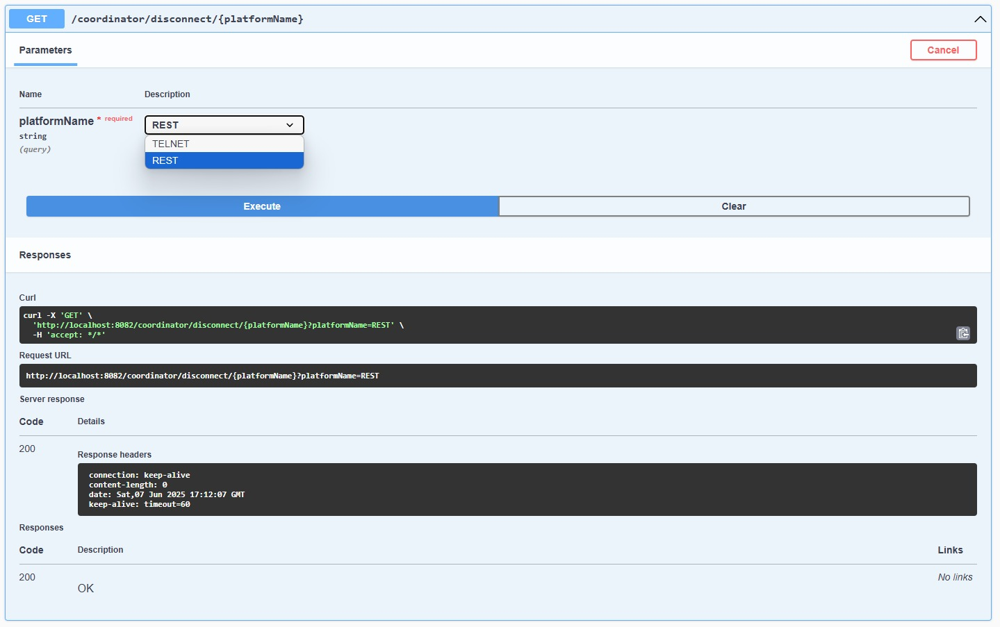

# FINSTANT(FINANS + INSTANT)
Finstant, finansal piyasa simülasyonu ve gerçek zamanlı veri üretimi sağlayan bir Java tabanlı uygulamadır. Farklı finansal enstrümanlar için sürekli güncellenen piyasa fiyatları (bid, ask) üretir ve bu verileri ilgili tüketicilere ve Telnet abonelerine dağıtır.

## Uygulama Nasıl Çalıştırılır
**Komut satırında çalıştırmadan önce dockerın açık olması gerekiyor.**
**elk_init.sh dosyası eğer ki CRLF ise hata verebilmektedir hata durumunda CRLF'den LF dosya sonu formatına dönüştürülebilir**
>git clone https://github.com/kayadogan1/Finstant

>cd Finstant

>make up

Bu adımlardan sonra uygulamanın çalışıyor olması gerekir.

### Özellikler
* Desteklenen çeşitli döviz kurları için piyasa verisi simülasyonu
* Gerçek zamanlı veriyi hem REST  hem de telnet üzerinden subscriberlara dağıtabilme
* Her bir connect olunan platform farklı bir thread üzerinde çalışır bu sayede multi-threadingli bir yapı sağlanmış olur.
* Ana uygulamadaki onRateUpdate metodu tetiklendiğinde güncellenen kurlar kafka kuyruğuna gönderilerek yayınlanmaktadır.
* Kafka consumer uygulaması kafkadaki rate topic'ini dinleyerek gelen kurları postgresql'e ve elasticSearche göndermektedir.
* Groovy ve exp4j kütüphaneleri kullanılarak runtimeda döviz kurlarının dinamik hesaplaması yapılmaktadır.
* Konfigürasyon aracılığı ile hesaplama yapılacak kütüphane seçilebilir groovy veya exp4j seçenekleri mevcut.
* Docker imageleri için Config/rate.properties dosyasında formüller override edilebilir.
* Kur güncellenmesinde etkilenen diğer kurlar recursive olarak algılanıp recursive olarak hesaplanmaktador.
* Veri tekrarına düşmemek için domain,consts ve contracts modülleri eklendi.
* Projemin Local ortam dışında build olup olmadığını algılamama yardım edecek basit bir ci pipeline ayarlandı.
* Her uygulama için docker file yazıldı.
* Tüm proje ekosistemini tek seferde ayağa kaldıracak docker compose dosyası yazıldı.
* Elasticsearch ve kibana için otomatik olarak index,dataView ve dashboard oluşturan elk_init.sh dosyası eklendi
* Elk_init.sh dosyasını çalıştıracak docker compose konfigürasyonu ayarlandı.
* Tüm projeyi kolayca ayağa kaldıran makefile yazıldı.

### CI Pipeline: 

## EKRANLAR

### Ana uygulamanın port bilgisi ve swagger arayüzü
>8082/swagger-ui/index.html
>

Platform2 rest port bilgisi ve swagger arayüzü
>8080/swagger-ui/index.html
>

### Telnet  port bilgisi ve terminal kullanımı

Telnet Platformuna terminal üzerinden bağlamak ya da disconnect olmak
isterseniz sadece şu işlemler yeterli:
> telnet localhost 8081
> 
> exit
> 
Aynı zamanda herhangi bir orana abone olmak ya da abonelikten çıkmak isterseniz şu işlemler yapılmalı:
> subscribe|pf1_usdtry
> 
> unsubscribe|pf1_usdtry
> 

### Kibana port bilgisi ve dashboard
>5601/app/dashboards
>

